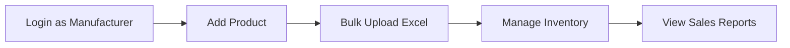
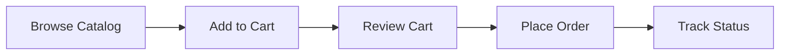
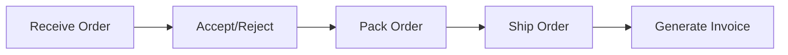
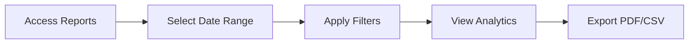
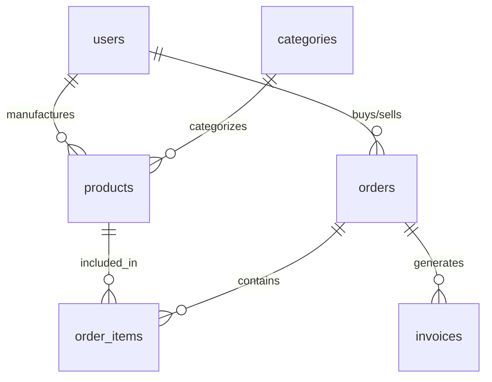

# 🚀 AuroMart — B2B Trade Partner Platform

A comprehensive, role-based B2B platform connecting **Manufacturers → Distributors → Retailers** with complete order management, inventory tracking, and business analytics.

## 📋 Table of Contents

- [Overview](#overview)
- [Features](#features)
- [Technology Stack](#technology-stack)
- [Quick Start](#quick-start)
- [Demo Accounts](#demo-accounts)
- [Key Flows](#key-flows)
- [API Documentation](#api-documentation)
- [Database Schema](#database-schema)
- [Deployment](#deployment)
- [Troubleshooting](#troubleshooting)

## 🎯 Overview

AuroMart is a production-ready B2B platform designed for the three-tier supply chain:
- **Manufacturers** create and manage product catalogs
- **Distributors** purchase from manufacturers and sell to retailers
- **Retailers** purchase from distributors for end-customer sales

### Key Highlights
- ✅ **Role-based Access Control** - Strict visibility rules enforced
- ✅ **Complete Order Lifecycle** - From placement to delivery
- ✅ **Inventory Management** - Real-time stock tracking
- ✅ **Invoice Generation** - PDF invoices with monthly exports
- ✅ **Business Analytics** - Sales reports and insights
- ✅ **Bulk Operations** - Excel upload for products
- ✅ **Mobile Responsive** - Works on all devices

## ✨ Features

### 🔐 Authentication & Roles
- **Manufacturer**: Product management, distributor orders, sales analytics
- **Distributor**: Catalog browsing, manufacturer orders, retailer management
- **Retailer**: Product browsing, distributor orders, purchase history

### 📦 Product Management
- **CRUD Operations**: Add, edit, delete products with full validation
- **Bulk Upload**: Excel file import with error reporting
- **Categories & Brands**: Organized product catalog
- **Stock Management**: Real-time inventory tracking
- **Image Support**: Product images via URL

### 🛒 Cart & Orders
- **Shopping Cart**: Add products, adjust quantities
- **Order Placement**: Two-layer ordering system
- **Order Lifecycle**: Pending → Accepted → Packed → Shipped → Delivered
- **Delivery Options**: Self-pickup, delivery, third-party courier
- **Reorder Templates**: Save and reuse order templates

### 📊 Business Intelligence
- **Sales Reports**: By partner, product, category, month
- **Export Options**: PDF and CSV formats
- **Real-time Analytics**: Dashboard with key metrics
- **Financial Tracking**: Revenue, expenses, profit margins

### 🧾 Invoice System
- **Automatic Generation**: When orders are shipped
- **PDF Format**: Professional invoice layout
- **Monthly Exports**: Bulk invoice downloads
- **Tax Calculations**: GST and other tax support

### 🔔 Notifications
- **Order Updates**: Status changes and decisions
- **Stock Alerts**: Low inventory notifications
- **System Messages**: Important announcements

## 🛠 Technology Stack

### Frontend
- **React 18** with TypeScript
- **TanStack Query** for data fetching
- **Tailwind CSS** for styling
- **Shadcn/ui** component library
- **Wouter** for routing

### Backend
- **Flask** (Python) REST API
- **SQLAlchemy** ORM
- **JWT** authentication
- **MySQL** database (EC2 hosted)
- **ReportLab** for PDF generation

### Infrastructure
- **Docker** containerization
- **Nginx** reverse proxy
- **Redis** caching
- **MySQL** on EC2 (3.249.132.231)

## 🚀 Quick Start

### Prerequisites
- Docker and Docker Compose
- Git
- Internet connection (for MySQL EC2)

### 1. Clone Repository
```bash
git clone <repository-url>
cd auroconnect-B2B-app
```

### 2. Environment Setup
```bash
# Copy environment template
cp env.example .env

# Edit .env file with your MySQL credentials
# DB_HOST=3.249.132.231
# DB_USER=your_username
# DB_PASSWORD=your_password
# DB_NAME=auromart
```

### 3. Start Application
```bash
# Build and start all services
docker-compose up -d

# Check status
docker-compose ps
```

### 4. Initialize Database
```bash
# Run seed data script
python create_comprehensive_seed_data.py
```

### 5. Access Application
- **Frontend**: http://localhost:3000
- **Backend API**: http://localhost:5000
- **API Health**: http://localhost:5000/api/health

## 👥 Demo Accounts

### Login Credentials
| Role | Email | Password | Business Name |
|------|-------|----------|---------------|
| **Manufacturer** | `m@demo.com` | `Demo@123` | Auro Manufacturer |
| **Distributor** | `d@demo.com` | `Demo@123` | Auro Distributor |
| **Retailer** | `r@demo.com` | `Demo@123` | Auro Retailer |

### Demo Data
- **8 Categories**: Laptop, Clothing, Mattress, Mobile, Electronics, Furniture, Kitchen Appliances, Sports Equipment
- **48 Products**: 6 products per category with realistic pricing
- **5 Demo Orders**: Complete order lifecycle examples
- **3 Invoices**: Generated PDF invoices

## 🔄 Key Flows

### 1. Product Management (Manufacturer)


**Steps:**
1. Login with `m@demo.com`
2. Navigate to **Products** page
3. Click **Add Product** or **Bulk Upload**
4. Fill product details and save
5. View products in catalog

### 2. Order Placement (Distributor/Retailer)


**Steps:**
1. Login with `d@demo.com` or `r@demo.com`
2. Browse **Products** catalog
3. Add items to cart
4. Review and place order
5. Track order status

### 3. Order Processing (Seller)


**Steps:**
1. Login as seller (Manufacturer/Distributor)
2. Navigate to **Orders** page
3. Accept or reject incoming orders
4. Update status through lifecycle
5. Generate invoice when shipped

### 4. Reports & Analytics


**Steps:**
1. Navigate to **Reports** page
2. Select date range and filters
3. View sales analytics
4. Export reports as needed

## 📚 API Documentation

### Authentication
```bash
# Login
POST /api/auth/login
{
  "email": "user@example.com",
  "password": "password"
}

# Register
POST /api/auth/register
{
  "email": "user@example.com",
  "password": "password",
  "business_name": "Business Name",
  "role": "manufacturer|distributor|retailer"
}
```

### Products
```bash
# Get products
GET /api/products

# Add product
POST /api/products
{
  "name": "Product Name",
  "sku": "SKU-001",
  "base_price": 100.00,
  "category_id": "category-id"
}

# Bulk upload
POST /api/products/bulk-upload
# Multipart form with Excel file
```

### Orders
```bash
# Get orders
GET /api/orders?status=pending&type=buying

# Create order
POST /api/orders
{
  "cart_items": [
    {"product_id": "product-id", "quantity": 2}
  ],
  "delivery_option": "DELIVER_TO_BUYER"
}

# Update status
PUT /api/orders/{order_id}/status
{
  "status": "ACCEPTED",
  "internal_notes": "Order accepted"
}
```

### Reports
```bash
# Sales report
GET /api/reports/sales?start_date=2024-01-01&end_date=2024-01-31

# Export CSV
GET /api/reports/export/csv?start_date=2024-01-01

# Export PDF
GET /api/reports/export/pdf?start_date=2024-01-01
```

### Invoices
```bash
# Get invoices
GET /api/invoices?month=1&year=2024

# Generate invoice
POST /api/invoices/generate/{order_id}

# Download invoice
GET /api/invoices/{invoice_id}/download
```

## 🗄 Database Schema

### Core Tables
- **users**: Business accounts with roles
- **products**: Product catalog with inventory
- **categories**: Product categorization
- **orders**: Order management with lifecycle
- **order_items**: Individual items in orders
- **invoices**: Generated invoices
- **cart_items**: Shopping cart management

### Relationships


## 🚀 Deployment

### Production Deployment
```bash
# Build production images
docker-compose -f docker-compose.prod.yml build

# Deploy to production
docker-compose -f docker-compose.prod.yml up -d

# Set up SSL with Let's Encrypt
# Configure domain and SSL certificates
```

### Environment Variables
```bash
# Database
DB_HOST=your-mysql-host
DB_USER=your-username
DB_PASSWORD=your-password
DB_NAME=auromart

# JWT
JWT_SECRET_KEY=your-secret-key

# Redis
REDIS_URL=redis://localhost:6379

# Frontend
VITE_API_URL=http://your-api-domain.com
```

## 🔧 Troubleshooting

### Common Issues

#### 1. Backend Connection Issues
```bash
# Check backend logs
docker-compose logs backend

# Verify database connection
docker-compose exec backend python -c "
from app import db
print('Database connected:', db.engine.execute('SELECT 1').scalar())
"
```

#### 2. Frontend Not Loading
```bash
# Check frontend logs
docker-compose logs frontend

# Rebuild frontend
docker-compose build frontend
docker-compose up -d frontend
```

#### 3. Database Migration Issues
```bash
# Reset database
docker-compose exec backend python reset_db.py

# Reinitialize
docker-compose exec backend python init_db_docker.py
```

#### 4. Permission Issues
```bash
# Fix file permissions
sudo chown -R $USER:$USER .

# Rebuild containers
docker-compose down
docker-compose build --no-cache
docker-compose up -d
```

### Performance Optimization
```bash
# Enable Redis caching
# Configure MySQL query cache
# Optimize Docker resources
# Set up CDN for static assets
```

## 📞 Support

### Getting Help
1. **Check Logs**: `docker-compose logs [service]`
2. **Verify Environment**: Ensure all variables are set
3. **Test Connectivity**: Check network and database access
4. **Review Documentation**: Check this README and code comments

### Common Commands
```bash
# View all logs
docker-compose logs -f

# Restart specific service
docker-compose restart backend

# Access container shell
docker-compose exec backend bash

# Check service health
docker-compose ps
```

## 📄 License

This project is licensed under the MIT License - see the [LICENSE](LICENSE) file for details.

## 🤝 Contributing

1. Fork the repository
2. Create a feature branch
3. Make your changes
4. Add tests if applicable
5. Submit a pull request

---

**🎉 Ready to transform your B2B operations with AuroMart!**

For questions or support, please refer to the troubleshooting section or create an issue in the repository. 