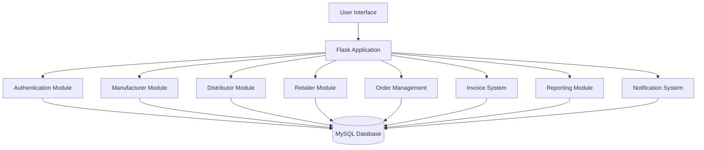
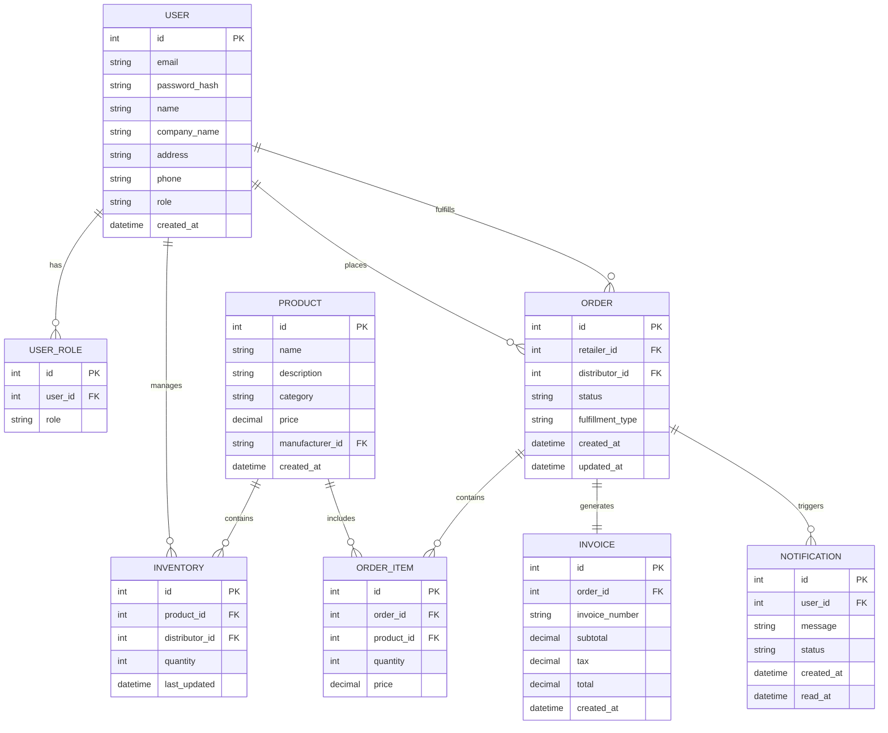
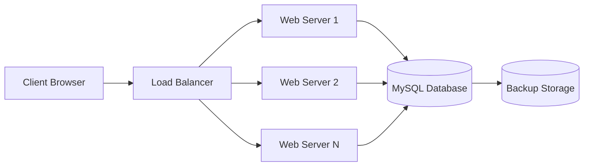

# AuroMart - B2B Supply Chain Management System

## Overview
AuroMart is a comprehensive B2B supply chain management web application that connects Manufacturers, Distributors, and Retailers in a streamlined workflow for product distribution. The system supports mattress, clothing, laptop, electronics, and general shop product distribution.

## System Architecture



## Technology Stack
- **Backend**: Python 3.8+, Flask, SQLAlchemy
- **Frontend**: Jinja2 Templates, HTML5, CSS3, JavaScript
- **Database**: MySQL
- **Authentication**: Flask-Login
- **PDF Generation**: WeasyPrint
- **Notifications**: Flask Webhooks (Simulated WhatsApp)
- **Deployment**: Docker, Docker Compose

## Python Dependencies
The application requires the following Python packages:
- Flask==2.3.2
- Flask-SQLAlchemy==3.0.5
- Flask-Login==0.6.3
- Flask-WTF==1.1.1
- Flask-Migrate==4.0.4
- PyMySQL==1.1.0
- WeasyPrint==59.0
- python-dotenv==1.0.0
- reportlab==4.0.4
- pandas==2.0.3
- openpyxl==3.1.2

## Project Structure
```
auroconnect-B2B-app/
├── Backend/
│   └── src/
│       ├── app.py                 # Flask application entry point
│       ├── config.py              # Configuration settings
│       ├── models/                # Database models
│       │   ├── __init__.py
│       │   ├── user.py            # User model (Manufacturer, Distributor, Retailer)
│       │   ├── product.py         # Product model
│       │   ├── inventory.py       # Inventory management
│       │   ├── order.py           # Order management
│       │   └── invoice.py         # Invoice model
│       ├── routes/                # Flask routes
│       │   ├── __init__.py
│       │   ├── auth.py            # Authentication routes
│       │   ├── manufacturer.py    # Manufacturer routes
│       │   ├── distributor.py     # Distributor routes
│       │   ├── retailer.py        # Retailer routes
│       │   └── api.py             # API endpoints
│       ├── utils/                 # Utility functions
│       │   ├── __init__.py
│       │   ├── pdf_generator.py   # PDF generation utilities
│       │   └── notifications.py   # Notification utilities
│       └── templates/             # Jinja2 templates
│           ├── base.html          # Base template
│           ├── auth/              # Authentication templates
│           ├── manufacturer/      # Manufacturer templates
│           ├── distributor/       # Distributor templates
│           └── retailer/          # Retailer templates
├── Frontend/
│   └── src/                       # Frontend assets (CSS, JS, images)
├── reports/                       # Generated reports
├── Invoice generation/            # Generated invoices
├── Deployment-ready structure/    # Docker and deployment files
├── .env                           # Environment variables
├── requirements.txt               # Python dependencies
├── README.md                      # Project documentation
└── docker-compose.yml             # Docker Compose configuration
```

## Database Schema Design



## User Roles and Permissions

### 1. Manufacturer
- Create, edit, delete products
- Assign products to distributors
- View downstream orders
- Generate sales reports
- Track fulfillment flow

### 2. Distributor
- View assigned products and stock
- Receive and respond to retailer orders
- Update order status
- Generate invoices
- Send notifications
- Generate reports

### 3. Retailer
- Browse product catalog
- Place orders
- Track order status
- Receive invoices
- Download reports

## Core Modules

### Authentication Module
- Role-based signup/login
- Secure password handling
- Session management
- Role-specific dashboards

### Manufacturer Module
- Product management (CRUD)
- Inventory assignment to distributors
- Order tracking
- Sales reporting

### Distributor Module
- Inventory management
- Order processing
- Status updates
- Invoice generation
- Notification system

### Retailer Module
- Product catalog browsing
- Order placement
- Order tracking
- Invoice management

### Order Flow
1. Manufacturer creates product and assigns to distributor
2. Retailer browses catalog and places order
3. Distributor receives notification and processes order
4. Distributor updates status through fulfillment stages
5. Invoice is generated upon delivery
6. All parties can track and report on orders

### Invoice System
- Auto-generation upon order completion
- PDF export
- Storage and retrieval
- WhatsApp notification

### Reporting Module
- Monthly reports
- Filterable dashboards
- Export to PDF/CSV
- Analytics by product, distributor, region

### Notification System
- Simulated WhatsApp alerts
- Order notifications
- Status updates
- Invoice notifications

## API Endpoints

### Authentication
- POST /api/auth/register
- POST /api/auth/login
- POST /api/auth/logout

### Manufacturer
- GET /api/manufacturer/products
- POST /api/manufacturer/products
- PUT /api/manufacturer/products/<id>
- DELETE /api/manufacturer/products/<id>
- POST /api/manufacturer/inventory/assign

### Distributor
- GET /api/distributor/inventory
- GET /api/distributor/orders
- PUT /api/distributor/orders/<id>/status
- POST /api/distributor/orders/<id>/accept
- POST /api/distributor/orders/<id>/reject

### Retailer
- GET /api/retailer/catalog
- POST /api/retailer/orders
- GET /api/retailer/orders
- GET /api/retailer/orders/<id>

### Reports
- GET /api/reports/monthly
- GET /api/reports/sales

## Deployment Architecture



## Security Considerations
- Password hashing with bcrypt
- JWT token authentication
- Role-based access control
- Input validation and sanitization
- SQL injection prevention
- CSRF protection
- Secure session management

## Scalability Considerations
- Database indexing for performance
- Caching frequently accessed data
- Asynchronous task processing for notifications
- Horizontal scaling with load balancing
- Database connection pooling

## Testing Strategy
- Unit tests for all modules
- Integration tests for API endpoints
- UI testing for frontend components
- Load testing for performance
- Security testing for vulnerabilities