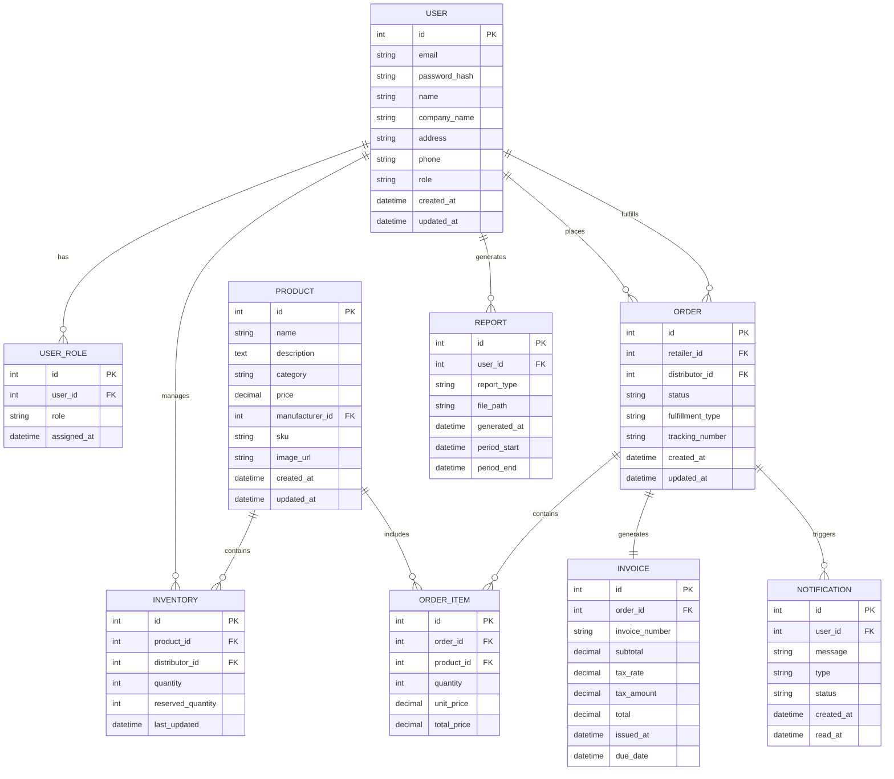

# AuroMart Database Design

## Overview
This document outlines the database schema for the AuroMart B2B supply chain management system. The database is designed to support three user roles (Manufacturer, Distributor, Retailer) and manage the complete flow of products from manufacturing to retail sale.

## Entity Relationship Diagram

## Table Definitions

### 1. USER Table
Stores information about all users in the system.

| Column Name | Data Type | Constraints | Description |
|-------------|-----------|-------------|-------------|
| id | INT | PRIMARY KEY, AUTO_INCREMENT | Unique identifier for the user |
| email | VARCHAR(255) | UNIQUE, NOT NULL | User's email address |
| password_hash | VARCHAR(255) | NOT NULL | Hashed password |
| name | VARCHAR(255) | NOT NULL | User's full name |
| company_name | VARCHAR(255) | NOT NULL | Company name |
| address | TEXT | NOT NULL | Company address |
| phone | VARCHAR(20) | NOT NULL | Contact phone number |
| role | ENUM('manufacturer', 'distributor', 'retailer') | NOT NULL | User's role in the system |
| created_at | DATETIME | NOT NULL | Timestamp when user was created |
| updated_at | DATETIME | NOT NULL | Timestamp when user was last updated |

### 2. USER_ROLE Table
Manages user roles and permissions.

| Column Name | Data Type | Constraints | Description |
|-------------|-----------|-------------|-------------|
| id | INT | PRIMARY KEY, AUTO_INCREMENT | Unique identifier |
| user_id | INT | FOREIGN KEY (USER.id), NOT NULL | Reference to user |
| role | ENUM('manufacturer', 'distributor', 'retailer') | NOT NULL | Role assigned to user |
| assigned_at | DATETIME | NOT NULL | Timestamp when role was assigned |

### 3. PRODUCT Table
Stores information about products created by manufacturers.

| Column Name | Data Type | Constraints | Description |
|-------------|-----------|-------------|-------------|
| id | INT | PRIMARY KEY, AUTO_INCREMENT | Unique identifier |
| name | VARCHAR(255) | NOT NULL | Product name |
| description | TEXT | NOT NULL | Product description |
| category | ENUM('mattress', 'clothing', 'laptop', 'electronics', 'general') | NOT NULL | Product category |
| price | DECIMAL(10,2) | NOT NULL | Product price |
| manufacturer_id | INT | FOREIGN KEY (USER.id), NOT NULL | Reference to manufacturer |
| sku | VARCHAR(100) | UNIQUE | Stock Keeping Unit |
| image_url | VARCHAR(500) | | URL to product image |
| created_at | DATETIME | NOT NULL | Timestamp when product was created |
| updated_at | DATETIME | NOT NULL | Timestamp when product was last updated |

### 4. INVENTORY Table
Tracks inventory levels for products at distributors.

| Column Name | Data Type | Constraints | Description |
|-------------|-----------|-------------|-------------|
| id | INT | PRIMARY KEY, AUTO_INCREMENT | Unique identifier |
| product_id | INT | FOREIGN KEY (PRODUCT.id), NOT NULL | Reference to product |
| distributor_id | INT | FOREIGN KEY (USER.id), NOT NULL | Reference to distributor |
| quantity | INT | NOT NULL, DEFAULT 0 | Available quantity |
| reserved_quantity | INT | NOT NULL, DEFAULT 0 | Quantity reserved for orders |
| last_updated | DATETIME | NOT NULL | Timestamp of last update |

### 5. ORDER Table
Stores information about orders placed by retailers.

| Column Name | Data Type | Constraints | Description |
|-------------|-----------|-------------|-------------|
| id | INT | PRIMARY KEY, AUTO_INCREMENT | Unique identifier |
| retailer_id | INT | FOREIGN KEY (USER.id), NOT NULL | Reference to retailer |
| distributor_id | INT | FOREIGN KEY (USER.id), NOT NULL | Reference to distributor |
| status | ENUM('pending', 'accepted', 'rejected', 'packed', 'dispatched', 'delivered') | NOT NULL | Current order status |
| fulfillment_type | ENUM('delivery', 'pickup') | | How order will be fulfilled |
| tracking_number | VARCHAR(100) | | Shipping tracking number |
| created_at | DATETIME | NOT NULL | Timestamp when order was created |
| updated_at | DATETIME | NOT NULL | Timestamp when order was last updated |

### 6. ORDER_ITEM Table
Stores individual items within an order.

| Column Name | Data Type | Constraints | Description |
|-------------|-----------|-------------|-------------|
| id | INT | PRIMARY KEY, AUTO_INCREMENT | Unique identifier |
| order_id | INT | FOREIGN KEY (ORDER.id), NOT NULL | Reference to order |
| product_id | INT | FOREIGN KEY (PRODUCT.id), NOT NULL | Reference to product |
| quantity | INT | NOT NULL | Quantity ordered |
| unit_price | DECIMAL(10,2) | NOT NULL | Price per unit at time of order |
| total_price | DECIMAL(10,2) | NOT NULL | Total price for this item |

### 7. INVOICE Table
Stores invoice information for completed orders.

| Column Name | Data Type | Constraints | Description |
|-------------|-----------|-------------|-------------|
| id | INT | PRIMARY KEY, AUTO_INCREMENT | Unique identifier |
| order_id | INT | FOREIGN KEY (ORDER.id), UNIQUE, NOT NULL | Reference to order |
| invoice_number | VARCHAR(50) | UNIQUE, NOT NULL | Unique invoice number |
| subtotal | DECIMAL(10,2) | NOT NULL | Subtotal before tax |
| tax_rate | DECIMAL(5,2) | NOT NULL | Tax rate percentage |
| tax_amount | DECIMAL(10,2) | NOT NULL | Tax amount |
| total | DECIMAL(10,2) | NOT NULL | Total amount |
| issued_at | DATETIME | NOT NULL | Timestamp when invoice was issued |
| due_date | DATETIME | NOT NULL | Payment due date |

### 8. NOTIFICATION Table
Stores notifications sent to users.

| Column Name | Data Type | Constraints | Description |
|-------------|-----------|-------------|-------------|
| id | INT | PRIMARY KEY, AUTO_INCREMENT | Unique identifier |
| user_id | INT | FOREIGN KEY (USER.id), NOT NULL | Reference to recipient |
| message | TEXT | NOT NULL | Notification message |
| type | ENUM('order', 'invoice', 'alert', 'info') | NOT NULL | Type of notification |
| status | ENUM('unread', 'read', 'archived') | NOT NULL | Notification status |
| created_at | DATETIME | NOT NULL | Timestamp when notification was created |
| read_at | DATETIME | | Timestamp when notification was read |

### 9. REPORT Table
Stores information about generated reports.

| Column Name | Data Type | Constraints | Description |
|-------------|-----------|-------------|-------------|
| id | INT | PRIMARY KEY, AUTO_INCREMENT | Unique identifier |
| user_id | INT | FOREIGN KEY (USER.id), NOT NULL | Reference to user who generated report |
| report_type | ENUM('sales', 'inventory', 'monthly') | NOT NULL | Type of report |
| file_path | VARCHAR(500) | NOT NULL | Path to report file |
| generated_at | DATETIME | NOT NULL | Timestamp when report was generated |
| period_start | DATETIME | NOT NULL | Start of report period |
| period_end | DATETIME | NOT NULL | End of report period |

## Indexes

### USER Table
- PRIMARY KEY (id)
- UNIQUE INDEX (email)
- INDEX (role)

### PRODUCT Table
- PRIMARY KEY (id)
- INDEX (manufacturer_id)
- INDEX (category)
- UNIQUE INDEX (sku)

### INVENTORY Table
- PRIMARY KEY (id)
- INDEX (product_id)
- INDEX (distributor_id)
- UNIQUE INDEX (product_id, distributor_id)

### ORDER Table
- PRIMARY KEY (id)
- INDEX (retailer_id)
- INDEX (distributor_id)
- INDEX (status)

### Other Tables
- All tables have PRIMARY KEY on id column
- Foreign key relationships are indexed for performance

## Database Constraints

### Foreign Key Constraints
1. USER_ROLE.user_id → USER.id
2. PRODUCT.manufacturer_id → USER.id
3. INVENTORY.product_id → PRODUCT.id
4. INVENTORY.distributor_id → USER.id
5. ORDER.retailer_id → USER.id
6. ORDER.distributor_id → USER.id
7. ORDER_ITEM.order_id → ORDER.id
8. ORDER_ITEM.product_id → PRODUCT.id
9. INVOICE.order_id → ORDER.id
10. NOTIFICATION.user_id → USER.id
11. REPORT.user_id → USER.id

## Sample Data Structure

### User Roles
- Manufacturer: Creates products and assigns inventory to distributors
- Distributor: Manages inventory and fulfills retailer orders
- Retailer: Browses catalog and places orders

### Product Categories
- mattress
- clothing
- laptop
- electronics
- general

### Order Status Flow
1. pending (initial state)
2. accepted/rejected (distributor decision)
3. packed (distributor has prepared order)
4. dispatched (order has been shipped)
5. delivered (order has been received)

### Notification Types
- order: Order-related notifications
- invoice: Invoice-related notifications
- alert: Important alerts
- info: Informational messages

## Database Initialization Script

The database will be initialized with:
1. Required tables as defined above
2. Sample users for each role
3. Sample products
4. Sample inventory assignments
5. Sample orders for testing

This schema provides a solid foundation for the AuroMart supply chain management system, supporting all required features while maintaining data integrity and performance.