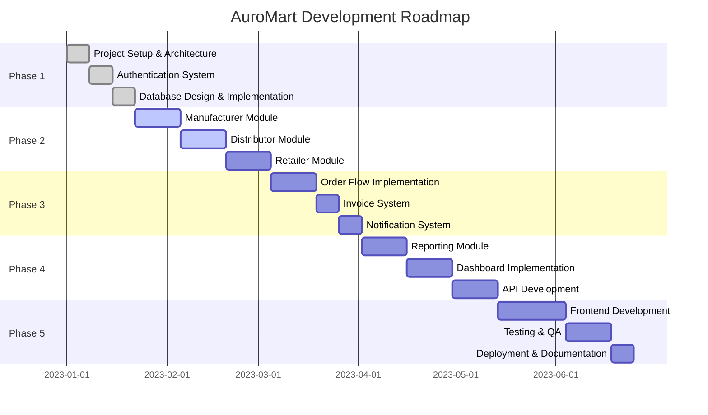

# AuroMart Project Roadmap

## Overview
This document outlines the development roadmap for the AuroMart B2B supply chain management system. The roadmap is divided into phases, each focusing on specific aspects of the application.

## Project Phases

## Phase 1: Foundation (Weeks 1-3)

### Week 1: Project Setup & Architecture
- [x] Project structure creation
- [x] Technology stack selection
- [x] Architecture documentation
- [x] Development environment setup
- [x] Version control initialization

### Week 2: Authentication System
- [x] User model implementation
- [x] Registration functionality
- [x] Login/logout functionality
- [x] Role-based access control
- [x] Session management

### Week 3: Database Design & Implementation
- [x] Database schema design
- [x] Model implementation
- [x] Migration setup
- [x] Initial data seeding
- [x] Database connection configuration

## Phase 2: Core Modules Development (Weeks 4-8)

### Week 4-5: Manufacturer Module
- [ ] Product management (CRUD)
- [ ] Inventory assignment
- [ ] Order tracking
- [ ] Sales reporting
- [ ] Unit testing

### Week 6-7: Distributor Module
- [ ] Inventory management
- [ ] Order processing
- [ ] Status updates
- [ ] Invoice generation
- [ ] Unit testing

### Week 8: Retailer Module
- [ ] Product catalog browsing
- [ ] Order placement
- [ ] Order tracking
- [ ] Invoice retrieval
- [ ] Unit testing

## Phase 3: Business Logic Implementation (Weeks 9-11)

### Week 9: Order Flow Implementation
- [ ] Order lifecycle management
- [ ] Status transition logic
- [ ] Inventory reservation
- [ ] Integration testing

### Week 10: Invoice System
- [ ] Auto-generation logic
- [ ] PDF generation
- [ ] Invoice storage
- [ ] Integration with order flow

### Week 11: Notification System
- [ ] WhatsApp simulation
- [ ] Message templates
- [ ] Notification routing
- [ ] Real-time updates

## Phase 4: Advanced Features (Weeks 12-15)

### Week 12: Reporting Module
- [ ] Sales reporting
- [ ] Inventory reporting
- [ ] Export functionality
- [ ] Dashboard integration

### Week 13-14: Dashboard Implementation
- [ ] Manufacturer dashboard
- [ ] Distributor dashboard
- [ ] Retailer dashboard
- [ ] Data visualization

### Week 15: API Development
- [ ] RESTful API endpoints
- [ ] Documentation
- [ ] Authentication integration
- [ ] Rate limiting

## Phase 5: Frontend & Deployment (Weeks 16-19)

### Week 16-18: Frontend Development
- [ ] UI component development
- [ ] Responsive design
- [ ] User experience optimization
- [ ] Cross-browser compatibility

### Week 19: Testing & QA
- [ ] Integration testing
- [ ] End-to-end testing
- [ ] Performance testing
- [ ] Security testing
- [ ] User acceptance testing

### Week 20: Deployment & Documentation
- [ ] Production deployment
- [ ] Monitoring setup
- [ ] User documentation
- [ ] Technical documentation
- [ ] Project handover

## Milestones

### Milestone 1: Architecture Complete (End of Week 3)
- Project structure established
- Authentication system functional
- Database design finalized
- Development environment ready

### Milestone 2: Core Modules Complete (End of Week 8)
- Manufacturer module functional
- Distributor module functional
- Retailer module functional
- Unit tests passing

### Milestone 3: Business Logic Complete (End of Week 11)
- Order flow implemented
- Invoice system functional
- Notification system operational
- Integration tests passing

### Milestone 4: Advanced Features Complete (End of Week 15)
- Reporting module functional
- Dashboards implemented
- API endpoints available
- Performance optimized

### Milestone 5: Product Ready (End of Week 20)
- Frontend complete
- All tests passing
- Production deployment
- Documentation complete

## Risk Management

### Technical Risks
- Database performance with large datasets
- Real-time notification scalability
- PDF generation performance
- Cross-browser compatibility issues

### Mitigation Strategies
- Performance testing at each phase
- Scalability planning
- Alternative libraries for PDF generation
- Comprehensive browser testing

### Schedule Risks
- Feature creep
- Integration challenges
- Testing delays
- Resource availability

### Mitigation Strategies
- Strict scope management
- Early integration testing
- Buffer time in schedule
- Cross-training team members

## Resource Allocation

### Development Team
- 1 Full-stack Developer (Flask/Python)
- 1 Frontend Developer (HTML/CSS/JavaScript)
- 1 Database Administrator (MySQL)
- 1 QA Engineer (Testing)
- 1 DevOps Engineer (Deployment)

### Tools and Infrastructure
- Development laptops
- Version control system (Git)
- CI/CD pipeline
- Testing environments
- Production hosting

## Success Metrics

### Technical Metrics
- Code coverage > 80%
- Response time < 2 seconds
- Uptime > 99.5%
- Security vulnerabilities < 5

### Business Metrics
- User adoption rate
- Order processing efficiency
- Error rate < 1%
- Customer satisfaction score

### Quality Metrics
- Bug count in production < 10
- Test pass rate > 95%
- Documentation completeness
- Performance benchmarks met

## Communication Plan

### Team Meetings
- Daily standups (15 minutes)
- Weekly sprint planning (1 hour)
- Bi-weekly retrospectives (1 hour)
- Monthly stakeholder updates (2 hours)

### Documentation
- Technical documentation updated weekly
- API documentation with each release
- User guides for each module
- Deployment guides for operations

### Stakeholder Communication
- Monthly progress reports
- Demo sessions every 2 weeks
- Risk assessment updates
- Budget and timeline tracking

This roadmap provides a structured approach to developing the AuroMart application, ensuring all requirements are met while maintaining quality and schedule adherence.