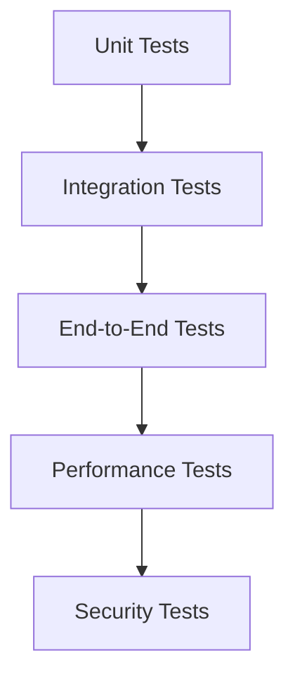

# AuroMart Testing Strategy

## Overview
This document outlines the comprehensive testing strategy for the AuroMart B2B supply chain management system. The testing approach covers all aspects of the application including unit tests, integration tests, end-to-end tests, and performance tests.

## Testing Pyramid

## Testing Frameworks and Tools

### Backend Testing
- **Unit Testing**: pytest
- **Integration Testing**: pytest with Flask test client
- **Database Testing**: pytest with SQLAlchemy
- **API Testing**: pytest with requests

### Frontend Testing
- **Unit Testing**: Jest
- **Component Testing**: React Testing Library
- **End-to-End Testing**: Cypress
- **Visual Testing**: Storybook

### Performance Testing
- **Load Testing**: Locust
- **Stress Testing**: Apache Bench
- **Database Performance**: MySQLTuner

### Security Testing
- **Static Analysis**: Bandit
- **Dependency Scanning**: Safety
- **Penetration Testing**: OWASP ZAP
- **Vulnerability Scanning**: Nmap

## Unit Testing Strategy

### Test Coverage Goals
- Minimum 80% code coverage
- 100% coverage for critical business logic
- Comprehensive edge case testing
- Regular coverage reports

### Backend Unit Tests

#### Authentication Module
- User registration with valid/invalid data
- Password hashing and verification
- Login with correct/incorrect credentials
- Session management
- Role-based access control

#### Manufacturer Module
- Product creation with valid/invalid data
- Product update functionality
- Product deletion
- Inventory assignment to distributors
- Sales report generation

#### Distributor Module
- Inventory management functions
- Order acceptance/rejection
- Order status updates
- Invoice generation
- Report generation

#### Retailer Module
- Product catalog browsing
- Order placement
- Order tracking
- Invoice retrieval

#### Order Flow Module
- Order status transitions
- Inventory reservation
- Inventory deduction on delivery
- Order history tracking

#### Invoice Module
- Invoice generation logic
- Tax calculation
- PDF generation
- Invoice numbering

#### Notification Module
- Message creation
- Message delivery simulation
- Message status tracking

### Frontend Unit Tests
- Component rendering
- State management
- Event handling
- Form validation
- API integration

## Integration Testing Strategy

### Database Integration
- Model creation and persistence
- Relationship mapping
- Query execution
- Transaction handling
- Migration testing

### API Integration
- Endpoint validation
- Request/response handling
- Error handling
- Authentication integration
- Data serialization

### Service Integration
- Email service integration
- PDF generation service
- File storage integration
- Third-party API integration

### Cross-Module Integration
- Authentication to all modules
- Order flow across all roles
- Inventory synchronization
- Reporting data consistency

## End-to-End Testing Strategy

### User Journey Tests

#### Manufacturer Journey
1. Registration and login
2. Product creation
3. Inventory assignment
4. Order tracking
5. Report generation

#### Distributor Journey
1. Registration and login
2. Inventory review
3. Order processing
4. Status updates
5. Invoice generation
6. Report generation

#### Retailer Journey
1. Registration and login
2. Product browsing
3. Order placement
4. Order tracking
5. Invoice retrieval
6. Report generation

### Order Flow Tests
1. Complete order lifecycle (Pending → Delivered)
2. Order rejection workflow
3. Inventory reservation and deduction
4. Invoice generation on delivery
5. Notification flow

### Edge Case Tests
- Concurrent order placement
- Inventory exhaustion
- Network failures
- Database connection issues
- File system errors

## Performance Testing Strategy

### Load Testing
- Simulate 100 concurrent users
- Test order placement under load
- Test report generation under load
- Test dashboard loading times

### Stress Testing
- Maximum concurrent users
- Database stress testing
- Memory usage monitoring
- CPU utilization tracking

### Scalability Testing
- Horizontal scaling validation
- Database performance with large datasets
- Response time consistency
- Resource utilization efficiency

### Performance Metrics
- Response time < 2 seconds for 95% of requests
- Database query time < 500ms
- Memory usage < 80% under normal load
- CPU usage < 70% under normal load

## Security Testing Strategy

### Authentication Security
- Password strength validation
- Session fixation prevention
- CSRF protection
- Brute force protection

### Authorization Security
- Role-based access control
- Resource ownership validation
- Privilege escalation prevention

### Data Security
- SQL injection prevention
- XSS protection
- Input validation
- Secure data transmission

### Infrastructure Security
- SSL/TLS configuration
- Firewall rules
- Container security
- Database security

## Test Environment Setup

### Development Environment
- SQLite database
- Debug mode enabled
- Mock external services
- Verbose logging

### Testing Environment
- MySQL database
- Test data seeding
- Isolated environment
- Performance monitoring

### Staging Environment
- Production-like configuration
- Real database
- Real external services
- Load testing capabilities

### CI/CD Integration
- Automated test execution
- Test result reporting
- Code coverage reporting
- Deployment blocking on test failure

## Test Data Management

### Test Data Strategy
- Separate test database
- Data seeding scripts
- Data cleanup procedures
- Test data versioning

### Sample Data Sets
- Sample users for each role
- Sample products in all categories
- Sample inventory assignments
- Sample orders in all states
- Sample invoices

### Data Privacy
- Anonymized test data
- No real user information
- Data encryption in test environments
- Regular data cleanup

## Test Automation

### Continuous Integration
- Run unit tests on every commit
- Run integration tests on pull requests
- Generate code coverage reports
- Block deployment on test failure

### Scheduled Testing
- Nightly full test suite execution
- Weekly performance testing
- Monthly security scanning
- Quarterly penetration testing

### Test Reporting
- Test result dashboards
- Code coverage reports
- Performance metrics
- Security scan results

## Manual Testing

### Exploratory Testing
- Ad-hoc testing of new features
- User experience validation
- Edge case discovery
- Usability testing

### User Acceptance Testing
- Business requirement validation
- User workflow testing
- Data accuracy verification
- Performance validation

### Cross-Browser Testing
- Chrome, Firefox, Safari, Edge
- Mobile browser testing
- Responsive design validation
- Compatibility testing

## Test Documentation

### Test Cases
- Detailed test case descriptions
- Expected results
- Preconditions
- Test data requirements

### Test Plans
- Test scope definition
- Test environment setup
- Test schedule
- Resource allocation

### Test Reports
- Test execution results
- Defect reports
- Performance metrics
- Security findings

## Defect Management

### Defect Tracking
- Issue tracking system (Jira)
- Defect severity classification
- Defect assignment workflow
- Defect resolution tracking

### Defect Lifecycle
1. Defect identification
2. Defect reporting
3. Defect assignment
4. Defect fixing
5. Defect verification
6. Defect closure

### Defect Prioritization
- Critical: System blocking issues
- High: Major functionality issues
- Medium: Minor functionality issues
- Low: Cosmetic issues

## Quality Gates

### Development Quality Gates
- Code review completion
- Unit test execution
- Code coverage threshold
- Static analysis passing

### Testing Quality Gates
- Test plan approval
- Test environment readiness
- Test execution completion
- Defect resolution threshold

### Release Quality Gates
- Regression test completion
- Performance test passing
- Security scan passing
- User acceptance testing

## Test Maintenance

### Test Suite Maintenance
- Regular test case review
- Test data updates
- Test environment maintenance
- Test tool updates

### Test Improvement
- Test coverage analysis
- Test execution time optimization
- Test reliability improvement
- Test automation expansion

This testing strategy ensures comprehensive coverage of all aspects of the AuroMart application, providing confidence in the quality and reliability of the system before release.