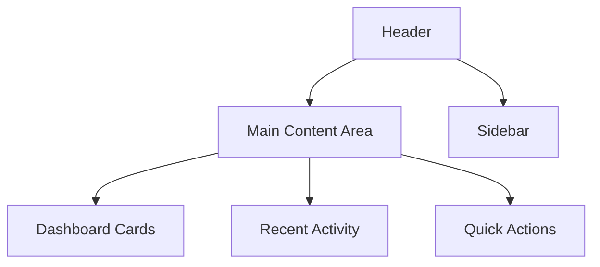
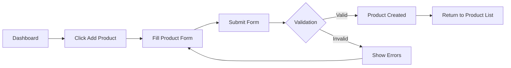
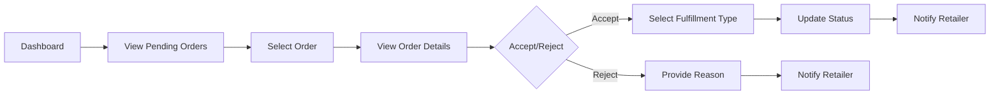
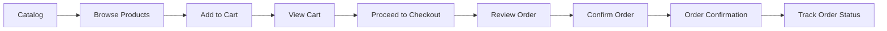

# AuroMart User Interface Design

## Overview
This document outlines the user interface design for the AuroMart B2B supply chain management system. The UI is designed to provide an intuitive and efficient experience for all three user roles: Manufacturer, Distributor, and Retailer.

## Design Principles

### User Experience Goals
1. **Simplicity**: Clean, uncluttered interfaces that focus on core tasks
2. **Efficiency**: Quick access to frequently used features
3. **Consistency**: Uniform design patterns across all modules
4. **Responsiveness**: Mobile-friendly layouts for on-the-go access
5. **Accessibility**: WCAG 2.1 compliant design for all users

### Visual Design
- **Color Scheme**: 
  - Primary: #2C3E50 (Dark Blue)
  - Secondary: #3498DB (Bright Blue)
  - Success: #27AE60 (Green)
  - Warning: #F39C12 (Orange)
  - Danger: #E74C3C (Red)
  - Light: #ECF0F1 (Light Gray)
  - Dark: #34495E (Dark Gray)

- **Typography**: 
  - Primary: 'Roboto', sans-serif
  - Secondary: 'Open Sans', sans-serif

- **Spacing**: 
  - Base unit: 8px
  - Consistent padding and margins using 8-point grid

## Common UI Components

### Navigation
- Top navigation bar with logo and user menu
- Role-specific sidebar navigation
- Breadcrumb navigation for deep pages
- Quick action buttons in header

### Dashboard Layout


### Form Elements
- Consistent input styling
- Clear validation feedback
- Required field indicators
- Help text and tooltips

### Data Tables
- Sortable columns
- Search and filter capabilities
- Pagination for large datasets
- Row actions (edit, delete, view)
- Bulk action support

### Modals and Dialogs
- Contextual confirmation dialogs
- Form submission modals
- Informational overlays
- Loading states

## Manufacturer Interface

### Dashboard
```
+-------------------------------------------------------------+
| Header with Logo, Navigation, User Menu                     |
+----------------------+--------------------------------------+
| Sidebar Navigation   | Main Content Area                    |
| - Products           | Dashboard Summary Cards:             |
| - Inventory          | 1. Total Products: XX                |
| - Orders             | 2. Pending Orders: XX                |
| - Reports            | 3. Total Distributors: XX            |
| - Settings           | 4. Monthly Sales: $XXXX              |
|                      |                                      |
|                      | Recent Activity Feed:                |
|                      | - New order from Retailer ABC        |
|                      | - Product XYZ assigned to Distributor|
|                      | - Monthly report generated           |
|                      |                                      |
|                      | Quick Actions:                       |
|                      | [+] Add Product  [↗] View Reports    |
+----------------------+--------------------------------------+
```

### Product Management
- Product listing table with search/filter
- Add/Edit product form modal
- Product details view
- Bulk actions (delete, assign)
- Category filtering

### Inventory Assignment
- Distributor selection interface
- Quantity assignment form
- Inventory distribution visualization
- Assignment history

### Order Tracking
- Order status dashboard
- Filter by distributor/product
- Order details view
- Status timeline visualization

### Reporting
- Report generation form
- Report type selection
- Date range picker
- Export options (PDF, CSV)
- Report history

## Distributor Interface

### Dashboard
```
+-------------------------------------------------------------+
| Header with Logo, Navigation, User Menu                     |
+----------------------+--------------------------------------+
| Sidebar Navigation   | Main Content Area                    |
| - Inventory          | Dashboard Summary Cards:             |
| - Orders             | 1. Available Inventory: XX items     |
| - Invoices           | 2. Pending Orders: XX                |
| - Notifications      | 3. Unread Messages: XX               |
| - Reports            | 4. Monthly Revenue: $XXXX            |
| - Settings           |                                      |
|                      | Recent Notifications:                |
|                      | 🛒 New order from Retailer ABC       |
|                      | 📄 Invoice #INV-123 ready            |
|                      |                                      |
|                      | Quick Actions:                       |
|                      | [↗] Process Orders  [↗] View Reports |
+----------------------+--------------------------------------+
```

### Inventory Management
- Inventory listing with stock levels
- Low stock alerts
- Inventory history timeline
- Product search and filtering

### Order Processing
- Order queue view
- Order details panel
- Status update controls
- Fulfillment type selection
- Accept/Reject workflow

### Invoice Management
- Invoice listing
- Invoice details view
- PDF download option
- Invoice status tracking

### Notification Center
- WhatsApp-style message interface
- Message threading
- Read/unread status
- Quick response options

## Retailer Interface

### Dashboard
```
+-------------------------------------------------------------+
| Header with Logo, Navigation, User Menu                     |
+----------------------+--------------------------------------+
| Sidebar Navigation   | Main Content Area                    |
| - Catalog            | Dashboard Summary Cards:             |
| - Orders             | 1. Available Products: XX            |
| - Invoices           | 2. Active Orders: XX                 |
| - Notifications      | 3. Unread Messages: XX               |
| - Reports            | 4. Monthly Spending: $XXXX           |
| - Cart               |                                      |
|                      | Recent Notifications:                |
|                      | ✅ Order #123 accepted               |
|                      | 📦 Order #123 ready for pickup       |
|                      | 📄 Invoice #INV-123 available        |
|                      |                                      |
|                      | Quick Actions:                       |
|                      | [↗] Browse Catalog  [↗] View Orders  |
+----------------------+--------------------------------------+
```

### Product Catalog
- Product grid or list view
- Category filtering
- Search functionality
- Product details modal
- Add to cart option

### Shopping Cart
- Cart summary
- Quantity adjustment
- Remove items
- Proceed to checkout

### Order Placement
- Order review screen
- Shipping information
- Order confirmation
- Order tracking

### Order Tracking
- Order status timeline
- Status update notifications
- Tracking information
- Order history

### Invoice Access
- Invoice listing
- Invoice details view
- PDF download
- Payment status

## Responsive Design

### Breakpoints
- **Mobile**: Up to 768px
- **Tablet**: 769px to 1024px
- **Desktop**: 1025px and above

### Mobile Adaptations
- Collapsible navigation menu
- Vertical layout for dashboard cards
- Simplified forms
- Touch-friendly controls
- Reduced information density

### Tablet Adaptations
- Sidebar navigation
- Two-column dashboard layout
- Standard form layouts
- Balanced information density

## Accessibility Features

### WCAG Compliance
- Proper color contrast ratios
- Keyboard navigation support
- Screen reader compatibility
- ARIA labels for interactive elements
- Focus indicators for interactive elements

### Visual Impairment Support
- High contrast mode
- Text scaling support
- Alternative text for images
- Clear visual hierarchy

### Motor Impairment Support
- Keyboard shortcuts
- Large touch targets
- Reduced motion options
- Voice control compatibility

## UI Component Specifications

### Buttons
- Primary: Solid color fill, white text
- Secondary: Border only, colored text
- Success: Green background
- Warning: Orange background
- Danger: Red background
- Disabled: Grayed out, reduced opacity

### Forms
- Consistent spacing between fields
- Clear labels and placeholders
- Inline validation messages
- Required field indicators
- Help text for complex fields

### Tables
- Alternating row colors
- Hover states for rows
- Sticky headers
- Sort indicators
- Responsive column hiding

### Cards
- Consistent padding
- Drop shadows for depth
- Clear headings
- Action buttons
- Status indicators

## User Flow Diagrams

### Manufacturer Product Creation Flow


### Distributor Order Processing Flow


### Retailer Order Placement Flow


## Performance Considerations

### Loading States
- Skeleton screens for content
- Progress indicators for long operations
- Optimistic UI updates
- Error states with retry options

### Data Handling
- Pagination for large datasets
- Lazy loading for images
- Caching strategies
- Efficient data fetching

### Animation and Transitions
- Smooth page transitions
- Subtle hover effects
- Loading animations
- Status change indicators

This UI design provides a comprehensive framework for implementing the AuroMart application interface, ensuring a consistent and intuitive experience across all user roles while maintaining performance and accessibility standards.